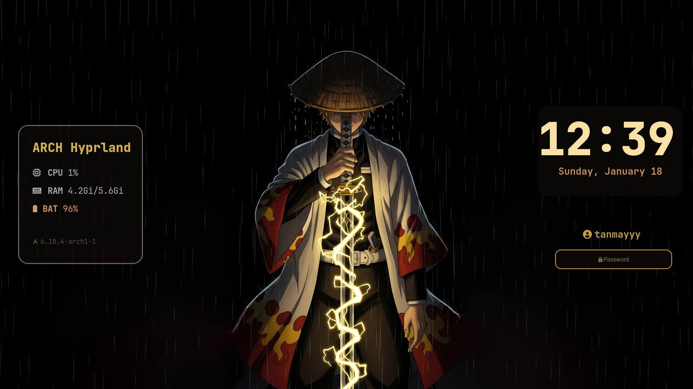
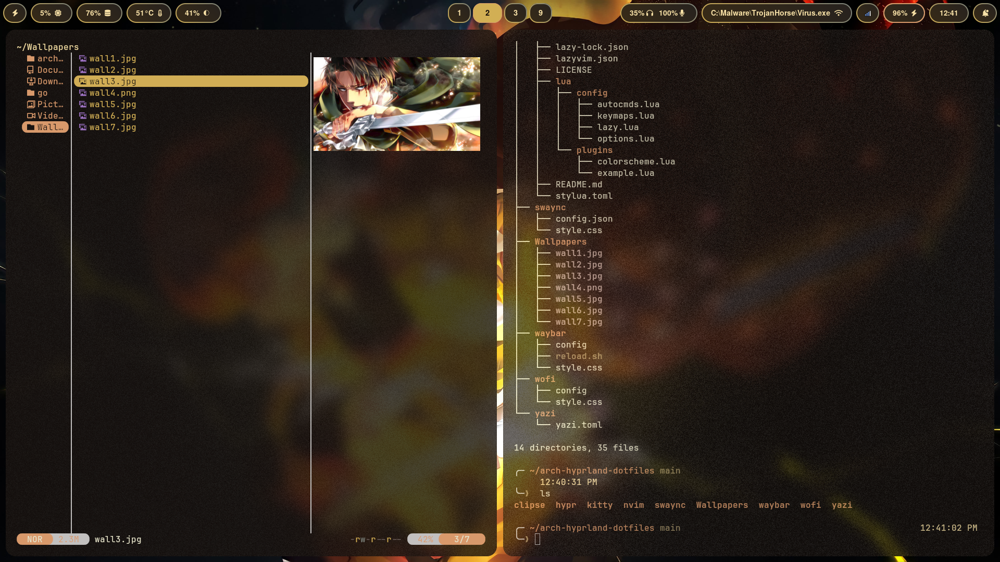
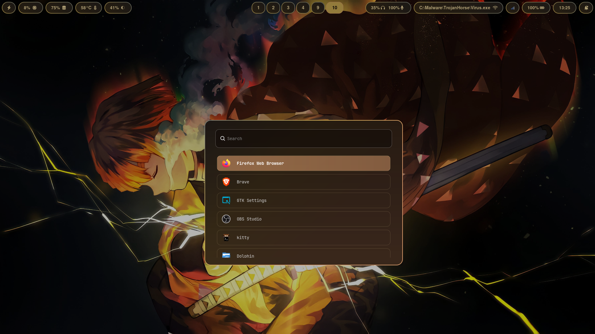

# Arch-Hyprland: Dotfiles

A minimal Hyprland configuration featuring a warm creamy yellow aesthetic, balanced with tasteful Gaussian blur and fine-grain noise.

---

## Components

- **WM:** [Hyprland](https://hyprland.org/) — Wayland compositor with smooth animations and tiling.
- **Bar:** [Waybar](https://github.com/Alexays/Waybar) — A highly customizable status bar, customized with workspace icons and system info.
- **Shell:** [Zsh](https://www.zsh.org/) — A Unix shell using the [Oh My Zsh](https://github.com/ohmyzsh/ohmyzsh) & [powerlevel10k](https://github.com/romkatv/powerlevel10k) framework for a better terminal experience.
- **Terminal:** [Kitty](https://sw.kovidgoyal.net/kitty/) — A fast, modern terminal emulator.
- **Editor:** [Neovim](https://neovim.io/) — My go-to text editor. Using [LazyVim](https://www.lazyvim.org/) as a distro.
- **File Manager:** [Yazi](https://github.com/sxyazi/yazi) — A TUI file manager that works blazing fast.
- **Launcher:** [Wofi](https://github.com/SimplyCEO/wofi) — Application launcher, power menu, bluetooth menu, and wifi menu.
- **Theming:** [Pywal16](https://github.com/eylles/pywal16) — For dynamic theming based on wallpapers.
- **Clipboard:** [Clipse](https://github.com/savedra1/clipse) — A TUI clipboard manager.
- **Lockscreen:** [Hyprlock](https://github.com/hyprwm/hyprlock) — A slick and simple looking lockscreen.
- **Wallpaper:** [Hyprpaper](https://github.com/hyprwm/hyprpaper) — Automatically set wallpapers.
- **Notifications:** [SwayNC](https://github.com/ErikReider/SwayNotificationCenter) — A modern notification center for Wayland.
- **Bluetooth:** [Bluetuith](https://github.com/darkhz/bluetuith) — A TUI-based Bluetooth manager.
- **Network:** `nmtui` — Simple text user interface for managing Wi-Fi and network connections.---

---

## Previews
Here are some images showcasing the layout & functionality of my setup:

